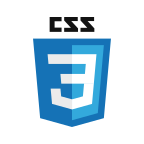
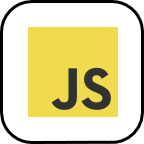
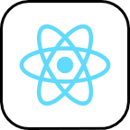
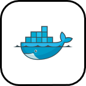
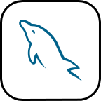
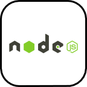
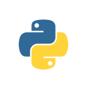
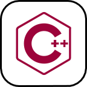
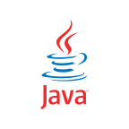
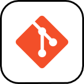

# Hey! 👋🏼

I'm Parjanya, a third year student learning **computer science** and **applied math** at UC Davis 🐮. Feel free to look around my profile and check out some of my personal projects!

## Languages and Tools

#### Front End Development 🖥

    
    
    
    
    

 

#### Backend Development 🧠

    
    
    
    
    

 

#### Other languages / tools 🛠

    
    
    
    

<!--
**pbrahmac/pbrahmac** is a ✨ _special_ ✨ repository because its `README.md` (this file) appears on your GitHub profile.

Here are some ideas to get you started:

- 🔭 I’m currently working on ...
- 🌱 I’m currently learning ...
- 👯 I’m looking to collaborate on ...
- 🤔 I’m looking for help with ...
- 💬 Ask me about ...
- 📫 How to reach me: ...
- 😄 Pronouns: ...
- ⚡ Fun fact: ...
-->
